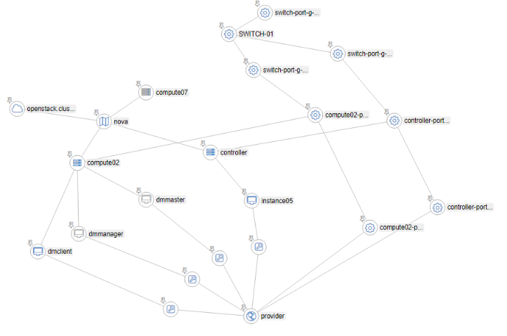

Với mục đích tổ chức resouce, phân tích alarm của vitrage thì chức năng hiển thị ra graph là tính năng quan trọng nhất của vitrage.
Graph được vitrage hiển thị có thể đưa ra mô hình các thực thể hệ thống, state + relation giữa các thực thể.

### 1. Hoạt động tạo graph
2 thành phần đóng góp hoạt động chính trong tạo graph này là vitrage datasouce-driver và vitrage graph.

vitrage datasouce-driver trách nhiệm thu thập thông tin về các resouce trong hệ thống: thuộc tính, trạng thái, mỗi quan hệ. Đồng thời cũng định nghĩa ra cách chuyển hóa thông tin này về các đỉnh, cạnh. Gọi đến *vitrage graph* để hiển thị

vitrage graph : sử dụng networkx diver trình diễn đồ thị cho người dùng. Đồng thời cũng trả lời các truy vẫn đồ thị của các thành phần khác .

Mỗi datasouce driver định nghĩa 2 class: Driver Class, Transformer Class
- Driver Class : Định nghĩa cách lấy thông tin về thực thể: resources (physical, virtual) ; alarms (Aodh, Nagios, Zabbix...) các sự cách thức lấy thông tin
- Transformer Class: Định nghĩa cách đưa được thông tin đó vào đồ thị, như:  với mỗi sự kiện cần thêm, sửa xóa các đỉnh, cạnh như thế nào

Khi khởi tạo graph, datasouce driver gọi "get-all" - lấy về toàn bộ thông tin hệ thống hiện tại. Bằng cách tạo các client gọi đến api của mỗi service (nova, neutron,...) 

Defaut cứ 10 phút, diver lại snapshot dữ liệu hiện tại và gọi get-all một lần

Khi có sự thay đổi trong hệ thống : vd thêm bớt host, có aodh alarm. Vitrage nhận biết bởi 1 trong 2 cách:
- polling mechanism: gọi đến hàm get_changes - định nghĩa trong Driver Class
- pushing mechanism: đọc được messeage từ message queue mà service đó gửi lên, topic "vitrage_notifications"
( chỉ có  static datasouce driver dùng polling - tức sẽ đọc từ thư mục- hoặc trong database; các datasouce khác đều sử dụng pushing mechaism)

Xem thêm về cách viết 1 datasouce tại : https://github.com/openstack/vitrage/blob/stable/queens/doc/source/contributor/add-new-datasource.rst
### Các loại datasouce: 
- service openstack : aodh, ceilometer, cinder, heat, neutron, nova.
- extenal monitor, gồm: collectd, zabix, nagios, doctor.
- static datasource: đọc thông tin từ các file cấu hình người dùng cấp

Cách vitrage chuẩn hóa thông tin từ datasouce:

https://github.com/openstack/vitrage/blob/stable/queens/doc/source/contributor/alarm-severity-config.rst

https://github.com/openstack/vitrage/blob/stable/queens/doc/source/contributor/resource-state-config.rst

### Cách cấu hình static datasouce: 
https://docs.openstack.org/vitrage/latest/contributor/static-config.html

Thêm vào /etc/vitrage/vitrage.conf
Viết template: 

### Cách cấu hình zabbix datasouce:
Cài đặt zabbix :
Cấu hình mapping thực thể vật lý:
- switch vào đồ thị
- host vào đồ thị

### Một số lỗi đã gặp
